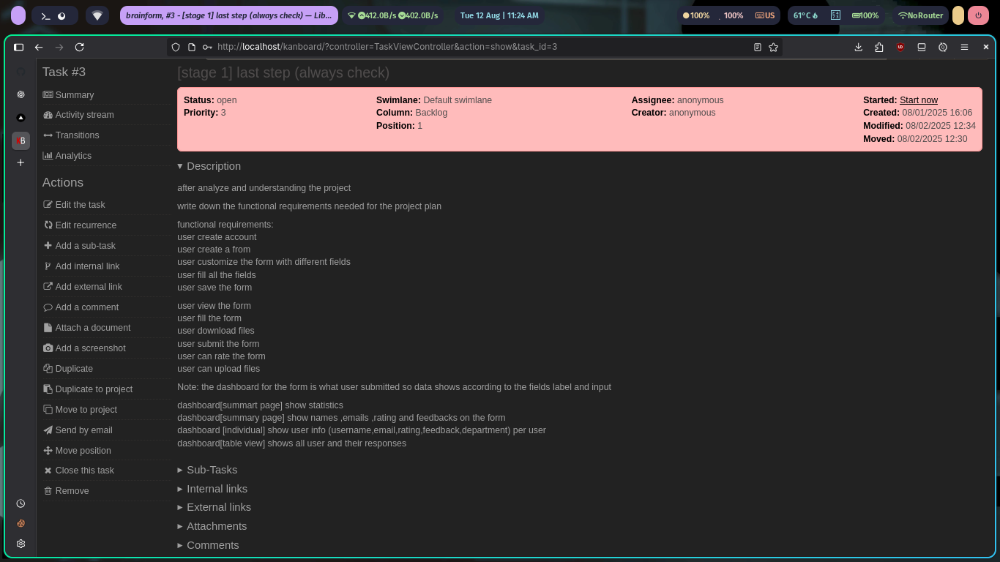
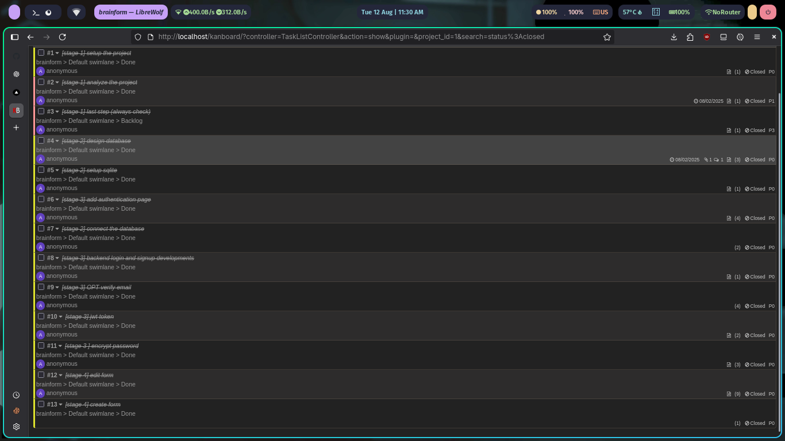

# 📌 Brain Form

BrainForm is a fully customizable online form builder that lets you design forms to your exact needs. Users can create, edit, and share forms with ease, while respondents can submit data seamlessly. Perfect for surveys, registrations, feedback collection, and more.

### 1. Planning Phase
- [x] setup project
- [x] analyze project
- [x] write functional requirments

### 2. database Phase
- [x] design the database
- [x] setup better-sqlite3 library and connect it
- [x] Add authentication

### 3. Developments Phase
- [x] add authentication page
- [x] develop backend for login and signup
- [x] setup jsonwebtoken
- [x] hash password with SHA-256
- [x] Create Form
- [x] Edit and update form
- [x] dashboard and summary for the form shows statistics and submissions

### 4. Testing & Deployment
- [x] testing with postman
- [ ] Unit testing
- [ ] Deployment to production

## 🔧 Technologies Used
- React
- Node.js
- Sqlite3

### Progress
this is the functional requirments

these are the tasks for the project

